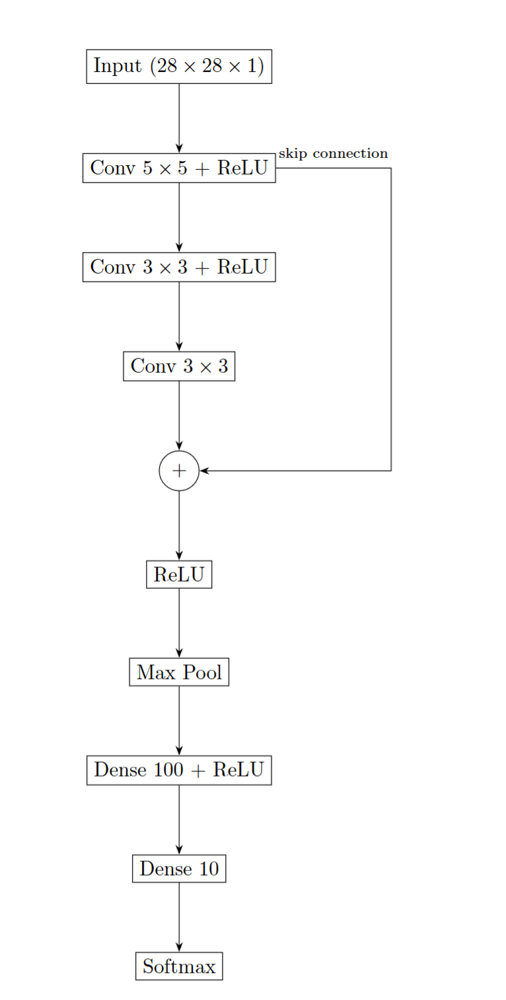

# Advanced Vision 2025 – CNN with Skip Connection

アドバンスドビジョン（2025年度）の課題として作成したリポジトリです。

『ゼロから作る Deep Learning ― Pythonで学ぶディープラーニング』
（斎藤 康毅，オライリー・ジャパン）に掲載されている
CNNのサンプル実装をベースに，ネットワーク構造を一部拡張しています。

---

## 概要

本リポジトリでは，基本的なCNN構造に **スキップ接続（skip connection）** を追加した
画像分類モデルを実装しています。

スキップ接続を導入することで，

- 勾配消失の緩和
- 浅い層の特徴と深い層の特徴の統合

を意図しています。

---

## ネットワーク構造

本課題で使用したネットワーク構造を以下に示します。

  

- 入力：28 × 28 × 1
- 畳み込み層：5×5 → 3×3 → 3×3
- 最初の畳み込み層の出力を，後段の出力と **加算（skip connection）**
- 加算後に ReLU，Max Pooling を適用
- 全結合層（100ユニット）を経て10クラス分類

---

## 変更点（オリジナル実装からの拡張）

書籍に掲載されている基本的なCNN実装に対して，以下の変更を行っています。

- 畳み込みブロックに **スキップ接続（加算）** を追加
- スキップ接続後に ReLU を適用する構造に変更
- ネットワーク構造を図として整理・可視化

---

## 実装環境

- Python 3.10
- NumPy

---

## License

This project is licensed under the MIT License.

This repository includes modified code based on examples from:

"ゼロから作る Deep Learning ― Pythonで学ぶディープラーニング"  
斎藤 康毅，オライリー・ジャパン  

The original code is provided under the MIT License.
